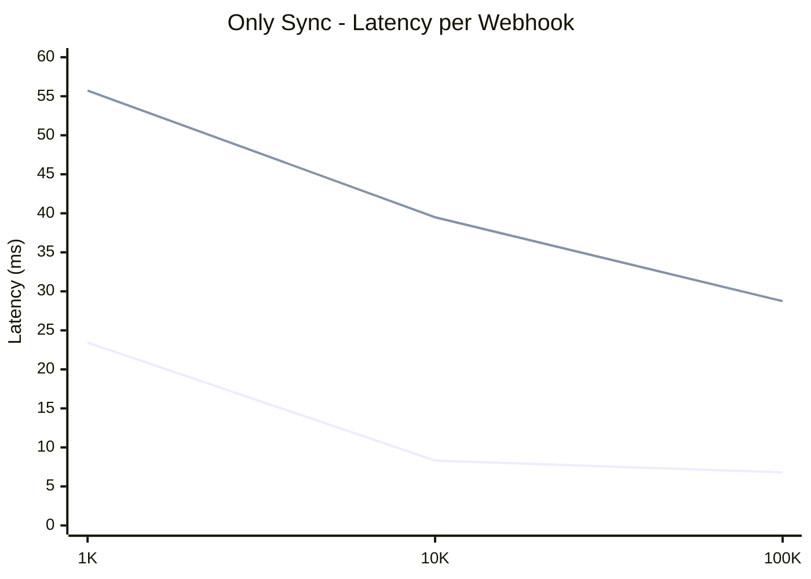
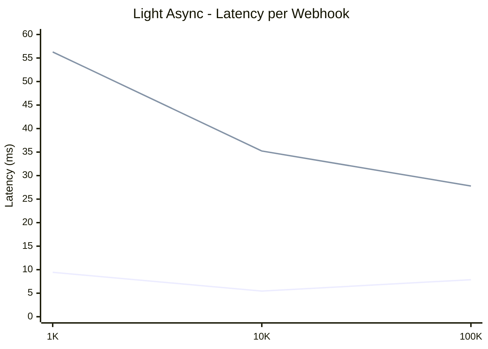
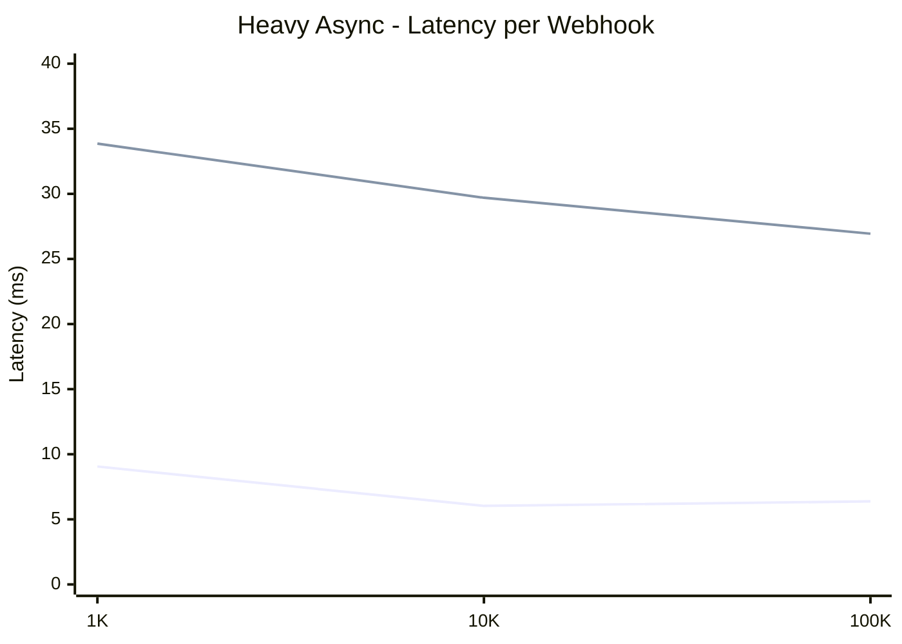
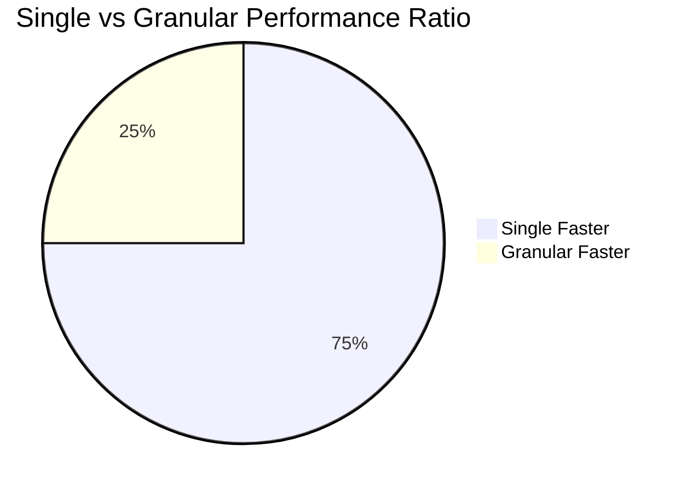

# Bullmq benchmark utility

## Description

This utility was designed to make a proof of concept for webhook distribution system on the topic of using bullmq as a processing queue for middlewares. It may be used for any other cases where various options of the queue job granularity persists. So the main question of the research is to perform one middleware per one bullmq job, or to perform the entire processing cycle of the object (many middlewares) per one bullmq job.

## Insallation

```
npm install
chmod +x deploy.sh run-benchmark.sh
```

## Running

```
./deploy.sh
./run-benchmark.sh
```

## Latency Per Webhook Analysis







## Performance Results

### Only Sync (validate, transform, addMetadata)

**Latency per Webhook:**

| Load Size   | Single Queue | Granular Queue | Performance Difference |
| ----------- | ------------ | -------------- | ---------------------- |
| **1,000**   | 🟢 23.44ms   | 🔴 55.73ms     | **Single 2.4x faster** |
| **10,000**  | 🟢 8.31ms    | 🔴 39.49ms     | **Single 4.8x faster** |
| **100,000** | 🟢 6.80ms    | 🔴 28.74ms     | **Single 4.2x faster** |

**Trend:** Single queue gets significantly faster at scale

---

### Sync + Light Async (validate, transform, rateLimit)

**Latency per Webhook:**

| Load Size   | Single Queue | Granular Queue | Performance Difference |
| ----------- | ------------ | -------------- | ---------------------- |
| **1,000**   | 🟢 9.44ms    | 🔴 56.29ms     | **Single 6.0x faster** |
| **10,000**  | 🟢 5.45ms    | 🔴 35.23ms     | **Single 6.5x faster** |
| **100,000** | 🟢 7.87ms    | 🔴 27.79ms     | **Single 3.5x faster** |

**Trend:** Largest performance gap at medium loads

---

### Sync + Heavy Async (validate, transform, enrich, heavyProcessing)

**Latency per Webhook:**

| Load Size   | Single Queue | Granular Queue | Performance Difference |
| ----------- | ------------ | -------------- | ---------------------- |
| **1,000**   | 🟢 9.06ms    | 🔴 33.86ms     | **Single 3.7x faster** |
| **10,000**  | 🟢 6.03ms    | 🔴 29.70ms     | **Single 4.9x faster** |
| **100,000** | 🟢 6.38ms    | 🔴 26.94ms     | **Single 4.2x faster** |

**Trend:** Consistent 4x advantage for single queue



Making multiple tasks in one bullmq job allows to achieve a significant increase in performance, so clearly a more profitable strategy will be processing the entire per cycle in one job. Various kubectl configurations were used in the research, but they did not make a significant contribution to the final result.
